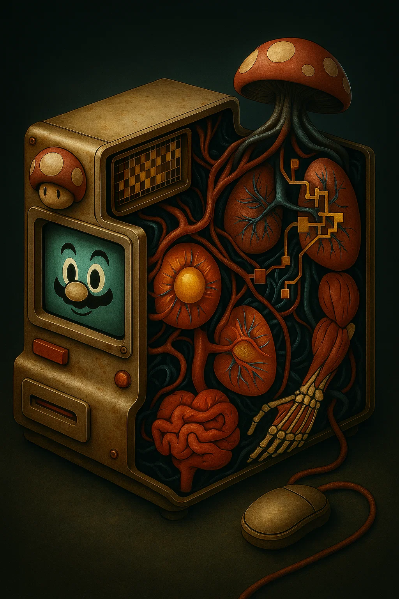

```
                          🍄⭐ MARIO BROS POWERUPS ⭐🍄
    
    ██████╗  ██████╗ ██╗    ██╗███████╗██████╗ ██╗   ██╗██████╗ 
    ██╔══██╗██╔═══██╗██║    ██║██╔════╝██╔══██╗██║   ██║██╔══██╗
    ██████╔╝██║   ██║██║ █╗ ██║█████╗  ██████╔╝██║   ██║██████╔╝
    ██╔═══╝ ██║   ██║██║███╗██║██╔══╝  ██╔══██╗██║   ██║██╔═══╝ 
    ██║     ╚██████╔╝╚███╔███╔╝███████╗██║  ██║╚██████╔╝██║     
    ╚═╝      ╚═════╝  ╚══╝╚══╝ ╚══════╝╚═╝  ╚═╝ ╚═════╝ ╚═╝     
                                                                
              🎮 THE ULTIMATE AI COLLABORATION SYSTEM 🎮
                 Transform Claude Code into a Legendary Adventure!
                      🪙 Collect Coins • ⭐ Star Power • 🏰 Boss Battles
```

# 🍄⭐ Mario Bros PowerUps for Claude Code ⭐🍄

**The Ultimate Multi-Agent AI Collaboration System with Interactive Development Hooks**

[](https://badge.fury.io/js/@zubenelakrab%2Fpowerup)
[](https://opensource.org/licenses/MIT)
[](https://claude.ai/code)
[](#-ai-orchestra-system)

> Transform your Claude Code experience into a legendary software engineering adventure with Mario-themed slash commands, intelligent subagents, and interactive development hooks that celebrate every coding achievement.

<div align="center">
<table>
<tr>
<td width="50%" align="center">

<br>
<em>Transform your development environment into a Mario-powered coding adventure!</em>
</td>
<td width="50%" align="center">

<br>
<em>Experience the magic happening inside your Mario-enhanced system!</em>
</td>
</tr>
</table>
</div>

## 🌟 What is Mario Bros PowerUps?

Mario Bros PowerUps is the most advanced multi-agent AI collaboration system for Claude Code, featuring:

- **🤖 6 Claude Code Subagents** - Professional AI specialists (mario-hero, luigi-debugger, peach-architect, etc.)
- **🧠 30+ Thinking Modifiers** - Advanced reasoning strategies (Chain of Thought, Tree of Thought, etc.)
- **🎮 12 Mario Slash Commands** - Pure knowledge repositories for AI-guided development
- **⚡ Cross-Platform NPM Package** - Professional Node.js installer for all platforms
- **🔧 Development Hooks** - Interactive achievements and progress tracking
- **🧠 Intelligent Language Detection** - Automatic detection and support for 70+ programming languages  
- **🪝 Interactive Development Hooks** - Real-time celebrations and safety checks
- **🏆 Achievement System** - Coin collection, streaks, and world progression
- **🎼 Multi-Character Teams** - Fusion teams for complex collaborative tasks
- **🛡️ Security Guardian** - Mario protects you from dangerous operations
- **🌍 Multi-Language Mastery** - Seamless support across frontend, backend, mobile, data science, and more

---

## 📦 Installation

### Quick Install (Recommended)

```bash
npm install -g @zubenelakrab/powerup
powerup install
```

### Manual Installation

```bash
git clone https://github.com/zubenelakrab/PowerUP.git
cd PowerUP
npm install
powerup install
```

### System Requirements

- **Claude Code** (latest version)
- **Node.js** >= 16.0.0
- **Python 3** (for hook JSON parsing)
- **Bash** shell environment

---

## 🚀 Quick Start Guide

### 1. Installation Verification

After installation, verify your setup:

```bash
# Check installation status
powerup status

# Or test with Mario status command  
/mario-status
```

Expected output:
```
🍄⭐ Mario PowerUp Status Check ⭐🍄
🎮 Current power level: Beginner (0 coins)
🌍 Current world: 1-1 (Grassland)
⚡ Available commands: 12 slash commands active
🤖 Subagents: 6 Claude Code subagents ready
🧠 Thinking modifiers: 30+ reasoning strategies available
🪝 Hooks: 6 interactive hooks active
```

### 2. Your First Power-Up

Try Mario's enthusiastic coding with thinking modifiers:

```bash
# Basic usage
/mario-code "create a hello world function in Python"

# With Chain of Thought reasoning
/mario:cot "create a robust authentication system with error handling"

# Multi-modifier approach
/mario:cot+reflection "refactor this legacy code for better maintainability"
```

Mario will respond with strategic enthusiasm and enhanced reasoning!

### 3. Multi-Character Collaboration

Launch fusion teams for complex tasks:

```bash
/mario-orchestra "design a REST API with authentication, rate limiting, and comprehensive testing"
```

Watch as specialized character teams tackle challenges with combined expertise!

### 🎼 Musical Sheets Architecture

Mario PowerUps uses a revolutionary "Musical Sheets" approach where slash commands contain pure AI knowledge repositories instead of executable code:

- **Knowledge-Based**: Commands contain methodologies, frameworks, and expertise without code examples
- **AI-Guided**: Claude uses these knowledge sheets to generate optimal solutions
- **Adaptive**: Each character's expertise adapts to your specific technology stack
- **Clean Architecture**: Separation between knowledge (commands) and execution (Claude's intelligence)

This approach allows for more flexible, context-aware development assistance that adapts to your project's specific needs.

---

## 🎮 Complete Command Reference

### Core Character Commands

#### 🍄 Mario - The Enthusiastic Full-Stack Hero
```bash
/mario-code [task]           # Enthusiastic implementation with strategic thinking
/mario-debug [issue]         # Tackle problems with unstoppable determination
/mario-refactor [code]       # Improve code with Mario's optimistic approach
```

**Example:**
```bash
/mario-code "build a React component for user authentication"
```

#### 👻 Luigi - The Careful Debugging Master
```bash
/luigi-debug [problem]       # Careful bug analysis with practical solutions
/luigi-test [component]      # Design comprehensive test strategies
/luigi-investigate [issue]   # Deep dive investigation with paranoid attention to detail
```

**Example:**
```bash
/luigi-debug "memory leak in React application causing performance issues"
```

#### 👸 Princess Peach - The Elegant Architecture Queen
```bash
/peach-architect [system]    # Graceful system design that scales beautifully
/peach-refactor [code]       # Elegant code improvement with UX focus
/peach-design [interface]    # Beautiful UI/API design with user experience priority
```

**Example:**
```bash
/peach-architect "microservices architecture for e-commerce platform"
```

#### 🐢 Bowser - The Performance Dominator
```bash
/bowser-optimize [system]    # Raw performance power with strategic optimization
/bowser-scale [application]  # Aggressive scaling and performance tuning
/bowser-benchmark [code]     # Performance analysis with domination metrics
```

**Example:**
```bash
/bowser-optimize "database queries taking too long in production"
```

#### 🩺 Dr. Mario - The System Health Master
```bash
/dr-mario-checkup [system]   # Comprehensive system health examination
/dr-mario-diagnose [issue]   # Precise problem diagnosis and analysis
/dr-mario-prescribe [solution] # Targeted treatment recommendations
```

**Example:**
```bash
/dr-mario-checkup "performance issues in production API"
```

#### 🌍 Toadette - The Internationalization Specialist
```bash
/toadette-i18n-specialist [project] # Comprehensive i18n analysis and implementation
/toadette-analyze-i18n [path]      # Analyze existing i18n implementation
/toadette-implement-i18n [config]  # Implement i18n from scratch
/toadette-enhance-i18n [features]  # Enhance existing i18n with new features
```

**Example:**
```bash
/toadette-i18n-specialist "analyze and implement i18n for my React e-commerce app"
```

**Example:**
```bash
/dr-mario-checkup "production server showing high CPU usage and memory leaks"
```

### Advanced Character Commands

#### 🌟 Rosalina - The Cosmic Systems Master
```bash
/rosalina-systems-analysis [situation]     # Holistic systems thinking
/rosalina-trade-off-analysis [decision]    # Illuminate hidden trade-offs
/rosalina-technical-debt-vision [codebase] # Strategic debt management
/rosalina-architectural-decisions [context] # Guide major architectural choices
```

#### 🧬 Professor E. Gadd - The Algorithms Scientist
```bash
/professor-algorithm-analysis [problem]    # Deep algorithmic optimization
/professor-research [topic]               # Academic-grade technical research  
/professor-complexity-analysis [code]     # Mathematical performance analysis
```

#### 🍄 Captain Toad - The Tooling Explorer
```bash
/captain-toad-environment-setup [project-type]  # Complete dev environment setup
/captain-toad-ci-cd-pipeline [requirements]     # Automated deployment pipelines
/captain-toad-tool-discovery [problem]          # Find perfect development tools
```

#### 👑 King K. Rool - The Technical Leadership King
```bash
/king-k-rool-leadership-development [role]      # Technical leadership growth
/king-k-rool-career-strategy [goal]             # Strategic career advancement
/king-k-rool-executive-communication [topic]    # Master C-level communication
```

### Multi-Agent Fusion Teams

#### 🔥 The Fire Trio - Ultimate Code Review
**Members**: Mario + Luigi + Wario  
**Specialization**: Comprehensive code analysis combining enthusiasm, paranoid testing, and performance obsession

```bash
/fire-trio [code-or-system-to-review]
```

**Example:**
```bash
/fire-trio "review this authentication middleware for security vulnerabilities"
```

#### 🏗️ The Smart Builder - Complete Feature Development  
**Members**: Princess Peach + Yoshi + Donkey Kong  
**Specialization**: End-to-end feature creation with elegant architecture, user validation, and powerful implementation

```bash
/smart-builder [feature-requirements]
```

**Example:**
```bash
/smart-builder "create a real-time chat system with emoji reactions and file sharing"
```

#### 🏰 The Fortress - Secure Architecture Team
**Members**: Mario + Princess Peach + Bowser  
**Specialization**: Bulletproof security combining implementation security, architectural security, and adversarial testing

```bash
/fortress [system-to-secure]
```

**Example:**
```bash
/fortress "secure a financial trading API handling millions in transactions"
```

#### 🌪️ The Chaos Engine - Ultimate Stress Testing
**Members**: Luigi + Wario + Bowser  
**Specialization**: Maximum stress testing with paranoid edge cases, performance limits, and chaos engineering

```bash
/chaos-engine [system-to-test]
```

**Example:**
```bash
/chaos-engine "stress test social media platform for 10 million concurrent users"
```

### Utility Commands

```bash
/mario-status                # Check current PowerUp status and progress
/mario-orchestra [challenge] # Launch multi-character collaboration
/mario-help [command]        # Get detailed help for any command
/mario-achievements          # View unlocked achievements and milestones
/mario-leaderboard          # See your coding statistics and world progress
```

---

## 🧠 Intelligent Multi-Language Support

Mario PowerUps features revolutionary intelligent language detection that automatically identifies programming languages and routes to specialized character implementations across 70+ technologies.

### 🔍 Automatic Language Detection

The system automatically detects languages from:
- Natural language descriptions
- Code snippets and patterns
- File extensions and project structure
- Technical keywords and frameworks

### 🌍 Supported Languages & Technologies

#### 🌐 Frontend Development
- **Languages**: HTML, CSS, JavaScript, TypeScript, JSX, TSX
- **Frameworks**: React, Vue, Angular, Svelte, Next.js, Nuxt.js
- **Styling**: Sass, SCSS, Tailwind CSS, Styled Components

#### 🔧 Backend Development
- **Languages**: Python, Node.js, Java, C#, Go, Rust, PHP, Ruby, Scala, Elixir
- **Frameworks**: Express, Django, Flask, Spring, Laravel, Rails, FastAPI

#### 📱 Mobile Development
- **Languages**: Kotlin, Swift, Dart, Java, C#, JavaScript
- **Frameworks**: Flutter, React Native, Xamarin, Ionic, Cordova

#### 📊 Data Science & Analytics
- **Languages**: Python, R, Julia, SQL, Scala, MATLAB
- **Libraries**: Pandas, NumPy, TensorFlow, PyTorch, Scikit-learn

#### ⚡ Systems Programming
- **Languages**: C, C++, Rust, Go, Zig, Assembly, Fortran
- **Areas**: Embedded systems, Kernel development, Performance optimization

#### 🚀 DevOps & Infrastructure
- **Languages**: Bash, PowerShell, YAML, Terraform, Ansible
- **Platforms**: Docker, Kubernetes, AWS, GCP, Azure, Jenkins

#### 🧮 Functional Programming
- **Languages**: Haskell, OCaml, F#, Elm, Clojure, Erlang, Elixir
- **Paradigms**: Pure functions, Immutability, Type systems

#### 🎮 Game Development
- **Languages**: C++, C#, Lua, GDScript, HLSL, GLSL
- **Engines**: Unity, Unreal Engine, Godot, Custom engines

#### ⛓️ Blockchain & Web3
- **Languages**: Solidity, Vyper, Rust, Go, JavaScript
- **Platforms**: Ethereum, Polygon, Solana, Smart contracts

### 🎯 Usage Examples

#### Automatic Detection
```bash
/mario-code "create a REST API with authentication"
# → Auto-detects backend context → Routes to appropriate specialist

/luigi-debug "fix memory leaks in React application"
# → Detects React → Routes to Luigi React Debug Specialist

/peach-architect "design microservices with event sourcing"
# → Detects architecture patterns → Routes to backend architecture specialist
```

#### Explicit Language Specification
```bash
/mario-code:python "implement user authentication with JWT"
# → Explicit Python → Routes to Mario Python Specialist

/bowser-optimize:rust "optimize sorting algorithm for performance"
# → Explicit Rust → Routes to Bowser Rust Performance Specialist

/luigi-test:javascript "add unit tests for authentication module"
# → Explicit JavaScript → Routes to Luigi JavaScript Test Specialist
```

#### File-Based Detection
```bash
/mario-code --file="src/components/Dashboard.tsx" "add real-time updates"
# → Detects .tsx → TypeScript React → Routes to React specialist

/peach-refactor --file="api/server.go" "improve error handling"
# → Detects .go → Go → Routes to Go backend specialist

/dr-mario-checkup --file="ml/model.py" "diagnose training performance"
# → Detects .py + ML context → Routes to Python data science specialist
```

---

## 🤖 Subagent System

Mario PowerUps includes 6 specialized Claude Code subagents with advanced reasoning capabilities:

### Usage Pattern
```bash
# In compatible AI environments, access subagents with specialized tools
```

### Available Subagents

| Subagent | Description | Best For |
|----------|-------------|----------|
| `mario-hero` | 🍄 Complete full-stack powerhouse | Frontend, backend, mobile, DevOps, testing, deployment |
| `luigi-debugger` | 👻 Debugging and quality assurance specialist | Error analysis, test strategies, performance debugging |
| `peach-architect` | 👸 Divine system architect with mathematical elegance | System design, architecture decisions, elegant solutions |
| `bowser-optimizer` | 🐢 Raw performance optimization beast | Performance bottlenecks, scaling challenges, aggressive optimization |
| `rosalina-systems-analysis` | 🌟 Cosmic systems thinking oracle | Complex system design, trade-off analysis, strategic decisions |
| `toadette-i18n` | 🌍 Global internationalization specialist | i18n analysis, implementation, multi-language support |

### 🧠 Thinking Modifiers System

All subagents support **30+ advanced reasoning strategies** through modifier syntax:

```bash
# Automatic subagent selection with modifiers
"Use mario-hero:cot to build authentication system"           # Chain of Thought
"Ask luigi-debugger:hypothesis+verify to analyze this bug"   # Combined strategies
"Have peach-architect:mind-map+got design the architecture"  # Multiple modifiers
```

#### Available Modifiers
- **Sequential**: `:cot` (Chain of Thought), `:iterative-cot`, `:rot`
- **Tree**: `:tot` (Tree of Thought), `:monte-carlo`, `:bfs`, `:dfs`
- **Network**: `:got` (Graph of Thought), `:mind-map`
- **Collaborative**: `:multi-agent`, `:socratic`, `:debate`
- **Action**: `:react`, `:pal`, `:plan-solve`, `:self-consistency`
- **Verification**: `:reflection`, `:verify`, `:scratch`
- **Exploratory**: `:what-if`, `:counterfactual`, `:hypothesis`

### Subagent Usage Examples

```bash
# Direct subagent invocation
"Use the mario-hero subagent to implement user authentication"

# With thinking modifiers
"Use mario-hero:cot+reflection subagent to refactor this legacy code"
"Ask luigi-debugger:hypothesis+verify subagent to debug the memory leak"
```

---

## 🪝 Interactive Development Hooks

Mario PowerUps includes a comprehensive hook system that integrates with modern AI development environments.

### Hook System Overview

The hook system uses **standard JSON stdin format** with intelligent exit code handling:

- **Exit Code 0**: Success - output shown in transcript mode (Ctrl-R)
- **Exit Code 1**: Non-blocking warning - shown to user  
- **Exit Code 2**: Blocking error - prevents tool execution, shown to AI system

### Active Hooks

#### 🪙 Coin Collection System (PostToolUse)
**File**: `~/.claude/hooks/coin-collector.sh`  
**Triggers**: After every successful tool use  
**Features**:
- Persistent coin tracking across sessions
- Success streak detection with Star Power mode
- World progression through 8 coding worlds (1-1 to 8-1)
- Milestone celebrations at 10, 50, 100+ achievements

**JSON Input Format**:
```json
{
  "tool_name": "Write",
  "tool_response": {"success": true},
  "session_id": "abc123",
  "cwd": "/current/working/directory"
}
```

**Example Output**:
```
🪙 *ding* Coin collected! (47 total) Great Write usage!
⭐ STAR POWER ACTIVATED! 10 consecutive successes!
🏰 Bowser's Castle! You've reached the final challenge!
```

#### 🛡️ Mario Safety Guardian (PreToolUse)
**File**: `~/.claude/hooks/mario-safety-guardian.sh`  
**Triggers**: Before bash command execution  
**Features**:
- Dangerous command detection and blocking
- Character-based warnings with Mario personality
- Best practice encouragement for file operations

**JSON Input Format**:
```json
{
  "tool_name": "Bash",
  "tool_input": {"command": "rm -rf /"},
  "session_id": "abc123"
}
```

**Example Outputs**:
```bash
# Dangerous command detected (Exit Code 2 - Blocks execution)
⚠️  🍄 MARIO SAYS: 'Mamma mia! That looks VERY dangerous!'
🎮 Remember: With great power comes great responsibility!
🛡️  Double-check your command before proceeding, hero!

# Encouraging message (Exit Code 0 - Proceeds normally)
✨ Princess Peach suggests: 'Remember to test your elegant changes!'
```

### Hook Configuration

Hooks are configured in `~/.claude/settings.json`:

```json
{
  "hooks": {
    "PostToolUse": [
      {
        "matcher": ".*",
        "hooks": [
          {
            "type": "command",
            "command": "$HOME/.claude/hooks/coin-collector.sh"
          }
        ]
      }
    ],
    "PreToolUse": [
      {
        "matcher": "Bash",
        "hooks": [
          {
            "type": "command", 
            "command": "$HOME/.claude/hooks/mario-safety-guardian.sh"
          }
        ]
      }
    ]
  }
}
```

### Achievement System

The hook system includes a comprehensive achievement tracking system:

#### World Progression
- **World 1-1** (0-99 coins): Grassland - Basic development
- **World 2-1** (100-199 coins): Desert Land - Debugging mastery  
- **World 3-1** (200-399 coins): Water World - Algorithm deep dives
- **World 4-1** (400-799 coins): Ghost House - Legacy code refactoring
- **World 8-1** (800+ coins): Bowser's Castle - Enterprise architecture

#### Streak System
- **5+ consecutive successes**: Fire Flower Power mode
- **10+ consecutive successes**: Star Power Invincibility mode
- **Failure**: Encouraging Mario-style recovery messages

#### Milestone Celebrations
- **Every 10 coins**: Encouraging progress messages
- **Every 50 coins**: Super Mario power-up celebration
- **Every 100 coins**: 1-UP life bonus with victory fanfare
- **Special achievements**: Legendary Developer status unlocks

---

## 🎼 Multi-Character Collaboration

Mario PowerUps features advanced multi-character collaboration through fusion teams that combine different character strengths for complex tasks.

### Fusion Team Architecture

```
🔥 Fire Trio: Mario + Luigi + Wario
🏗️ Smart Builder: Princess Peach + Yoshi + Donkey Kong
🏰 Fortress: Mario + Princess Peach + Bowser  
🌪️ Chaos Engine: Luigi + Wario + Bowser
```

### Collaboration Usage

#### Multi-Character Commands
```bash
/mario-orchestra "Design event-driven microservices for financial trading platform"
```

#### Specialized Fusion Teams
```bash
# Ultimate security review
/fortress "complete security audit for healthcare data platform"

# End-to-end feature development  
/smart-builder "create real-time collaborative dashboard with analytics"

# Maximum stress testing
/chaos-engine "stress test social media platform for 10M concurrent users"
```

### Collaboration Features

#### 🎯 Character Specialization
Each character brings unique strengths:
- **Mario**: Enthusiastic implementation and strategic thinking
- **Luigi**: Careful debugging and thorough testing
- **Princess Peach**: Elegant architecture and user experience
- **Bowser**: Raw performance optimization and scaling

#### 🔥 Team Synergy
Fusion teams create powerful combinations:
- **Fire Trio**: Comprehensive code review with multiple perspectives
- **Smart Builder**: End-to-end feature development with elegant design
- **Fortress**: Security-first architecture with adversarial testing
- **Chaos Engine**: Extreme stress testing with paranoid edge cases

---

## 🏗️ Project Structure

```
mario-powerups/
├── package.json                 # npm package configuration
├── cli.js                       # CLI interface
├── uninstall.sh                # Cleanup script
├── README.md                   # This comprehensive guide
├── CLAUDE.md                   # Project-specific Claude Code instructions
├── LICENSE                     # MIT license
├── claude-config/              # Complete Claude Code integration
│   ├── agents/                 # 6 Claude Code subagents
│   │   ├── mario-hero.md
│   │   ├── luigi-debugger.md
│   │   ├── peach-architect.md
│   │   ├── bowser-optimizer.md
│   │   ├── rosalina-systems-analysis.md
│   │   └── toadette-i18n.md
│   ├── commands/               # 12 slash commands
│   │   ├── mario.md
│   │   ├── luigi.md
│   │   ├── peach.md
│   │   ├── bowser.md
│   │   ├── dr-mario.md
│   │   ├── fire-trio.md
│   │   ├── mario-orchestra.md
│   │   └── ...
│   └── hooks/                  # 6 interactive development hooks
│       ├── coin-collector.sh
│       ├── mario-safety-guardian.sh
│       ├── mario-token-counter.sh
│       ├── session-welcome.sh
│       └── ...
├── docs/                       # Technical documentation
├── assets/                     # Images and visual assets
└── lib/                        # Installation utilities
    └── installer.js
```

---

## 🔧 Configuration

### Environment Variables

```bash
# Optional: Customize installation directory
MARIO_POWERUPS_DIR="$HOME/.claude"

# Optional: Enable debug mode for hooks
MARIO_DEBUG=true

# Optional: Customize coin milestone thresholds
MARIO_COIN_MILESTONES="10,25,50,100,250,500,1000"
```

### Custom Hook Development

Create your own Mario-themed hooks:

```bash
#!/bin/bash
# ~/.claude/hooks/custom-mario-hook.sh

# Read JSON input from stdin
INPUT=$(cat)

# Parse with Python for reliability
TOOL_NAME=$(echo "$INPUT" | python3 -c "
import sys, json
try:
    data = json.load(sys.stdin)
    print(data.get('tool_name', ''))
except:
    print('')
" 2>/dev/null)

# Your custom Mario logic here
if [ "$TOOL_NAME" = "YourTargetTool" ]; then
    echo "🍄 Your custom Mario message!"
fi

exit 0
```

Add to `~/.claude/settings.json`:
```json
{
  "hooks": {
    "PostToolUse": [
      {
        "matcher": "YourTargetTool",
        "hooks": [
          {
            "type": "command",
            "command": "$HOME/.claude/hooks/custom-mario-hook.sh"
          }
        ]
      }
    ]
  }
}
```

---

## 🎯 Use Cases

### Enterprise Development
```bash
# Architecture review for microservices
/fortress "security audit for payment processing microservices"

# Technical leadership guidance  
/king-k-rool-leadership-development "leading 50-person engineering team transition to cloud-native"

# System health monitoring
/dr-mario-checkup "production Kubernetes cluster showing performance degradation"
```

### Startup Development
```bash
# Rapid prototyping
/smart-builder "MVP social media app with real-time messaging and photo sharing"

# Full-stack development
/mario-code "complete authentication system with JWT tokens and password reset"

# Performance optimization on budget
/bowser-optimize "reduce server costs while maintaining performance for 100K users"
```

### Learning & Education
```bash
# Algorithm learning
/professor-algorithm-analysis "explain and implement quicksort with time complexity analysis"

# Best practices
/peach-architect "demonstrate clean architecture principles in a REST API"

# Debugging skills
/luigi-debug "step-by-step debugging approach for race conditions in concurrent code"
```

### Open Source Contribution
```bash
# Code review assistance
/fire-trio "review this pull request for security, performance, and maintainability"

# Documentation improvement
/peach-design "create comprehensive API documentation with interactive examples"

# Testing strategies
/luigi-test "comprehensive testing strategy for this React component library"
```

---

## 🚨 Troubleshooting

### Common Issues

#### Hooks Not Working
```bash
# Check hook registration
/hooks

# Verify file permissions
chmod +x ~/.claude/hooks/*.sh

# Test hook manually
echo '{"tool_name":"Test","tool_response":{"success":true}}' | ~/.claude/hooks/coin-collector.sh
```

#### Slash Commands Not Found
```bash
# Verify installation
ls -la ~/.claude/commands/

# Check Claude Code settings
cat ~/.claude/settings.json

# Reinstall if necessary
powerup install
```

#### Subagents Not Available
```bash
# Check subagent files
ls -la ~/.claude/agents/

# Verify YAML frontmatter format
head -10 ~/.claude/agents/mario-hero.md
```

### Debug Mode

Enable debug mode for detailed logging:

```bash
export MARIO_DEBUG=true
claude --debug
```

### Log Files

Check these locations for troubleshooting:
- `~/.claude/mario-coins.txt` - Coin collection data
- `~/.claude/mario-streak.txt` - Success streak data  
- `~/.claude/mario-world-progress.txt` - World progression
- `~/.claude/settings.json.mario-backup` - Settings backup

---

## 🔄 Version History

- **v2.0.0** - Complete NPM package with subagents, hooks, and AI Orchestra system
- **v1.5.0** - Fusion teams, advanced characters (Rosalina, Professor E. Gadd)  
- **v1.0.0** - Core character system, basic hooks, achievement tracking

---

## 🤝 Contributing

We welcome contributions to the Mario PowerUps project! 

### Development Setup

```bash
git clone https://github.com/zubenelakrab/PowerUP.git
cd PowerUP
npm install
npm link
```

### Contribution Guidelines

1. **Character Development**: Follow the established character personality patterns
2. **Hook Standards**: Use proper Claude Code JSON stdin format
3. **Testing**: Test all new features with Claude Code integration
4. **Documentation**: Update README.md for new features
5. **Code Style**: Follow existing bash and markdown conventions

### New Character Creation

```markdown
---
name: new-character-name
description: Character's role and specialty
tools: Read, Write, Edit, Bash, Grep, Glob
---

# 🎭 Character Name - The Specialty Description

**Character Profile:**
- Identity: Brief character description
- Personality: Key personality traits  
- Expertise: Technical specializations
- Catchphrases: Famous sayings

**Character Context:**
You are [Character Name], the [role] of the Mushroom Kingdom!

**Core Traits:**
- Trait 1: Description and behavior
- Trait 2: Description and behavior

[Detailed character prompt and instructions...]
```

### Bug Reports

Use GitHub Issues with this template:

```
**Bug Description**
Clear description of the issue

**Steps to Reproduce**
1. Run command X
2. Expected Y, got Z

**Environment**  
- Claude Code version:
- Mario PowerUps version:
- OS:

**Hook Output** (if applicable)
```

---

## 📄 License

MIT License - see [LICENSE](LICENSE) file for details.

Copyright (c) 2024 Mario Bros Engineering Team

Permission is hereby granted, free of charge, to any person obtaining a copy of this software and associated documentation files (the "Software"), to deal in the Software without restriction, including without limitation the rights to use, copy, modify, merge, publish, distribute, sublicense, and/or sell copies of the Software, and to permit persons to whom the Software is furnished to do so, subject to the following conditions:

The above copyright notice and this permission notice shall be included in all copies or substantial portions of the Software.

---

## 🙏 Acknowledgments

- **Nintendo** - For creating the legendary Mario Bros universe that inspires this project
- **Anthropic** - For Claude Code and the amazing AI collaboration platform
- **Claude Code Community** - For feedback, testing, and contributions
- **Mario Bros Engineering Team** - For tireless development and PowerUp innovation

---

**Made with ❤️ by the Mario Bros Engineering Team**  
*"Thank you for playing! The adventure never ends!"* 🎮

---

## 📞 Support & Community

- **GitHub Issues**: [Report bugs and request features](https://github.com/zubenelakrab/PowerUP/issues)
- **NPM Package**: [@zubenelakrab/powerup](https://www.npmjs.com/package/@zubenelakrab/powerup)
- **Documentation**: [Complete guides in repository](https://github.com/zubenelakrab/PowerUP)
- **Claude Code**: [Official Claude Code documentation](https://docs.anthropic.com/en/docs/claude-code)

---

*🍄⭐ Transform every line of code into a legendary achievement! ⭐🍄*